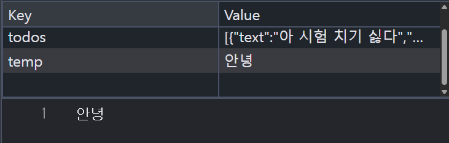

ch07_review

# todo / shoppinglist의 script 분할
```html
<script src="./01_todolist.js" defer></script>
```

defer : html `<script>` 태그에 사용하는 속성중 하나로, 스크립트 파일 다운 방식 제어

defer 사용시에는 웹 페이지의 HTML 파싱을 중단하지 않고 스크립트 로직을 다운, 그리고 다운로드 완료 이후에 HTml 문서의 파싱이 끝나는 시점에 스크립트 실행

- html 문서에 명시된 순서대로 실행 보장

- 저희 로직이 그렇게 복잡하거나 긴게 아닌데 안되는 건 컴퓨터 문제일 확률이 높아서 그렇습니다.

# Todolist 복습
localStorage의 저장 방식
key - value 쌍으로 이루어져있고, value에는 다양한 자료형이 들어갈 수 있습니다.

todolist에는 todos라는 key에 value로 배열이 들어가 있고, 배열 내부요소는 JS 객체 형태로 되어있습니다.

하지만 모든 localStorage의 value가 배열일 필요가 없다는 예시



내일 이후부터 html / css / js 복습을 위한 동영상 강의가 불시에 수강하라고 할 수도 있으니 유무선 이어폰 챙겨다니시기 바랍니다.

# 자리 이동 후
git clone 방법
1. C 드라이브에 영어 이름 생성
2. shift + 우클릭 -> Code로 실행 -> vs code를 켰습니다
3. 2. 과정에서 C:여러분 영어이름 폴더 경로로 vs code가 켜졌는지 확인
4. git clone 여러분 깃허브 리포지토리 주소 화면 최종 push한 파일을 기준으로 복사가 됩니다.
5. 좌하단에 vs code 상에서 github 로그인을 했습니다.
  1. 여러분의 원래 자리와 바뀐 자리 간에 vs 설정이 다르다면 충돌 감지라는 alert이 뜨게 되는데,
  2. 원격 설정으로 처리하면 여러분들의 원래 자리 설정을 기준으로 현재 자리의 설정을 다 바꾸게 됩니다.
6. C:여러분영어이름폴더 vs code를 끄고, korit_07_javascript를 기준으로 shift + 우클릭 -> code로 켜기를 실행했습니다.
  1. 이유 -> .git이 이미 있습니다
  2. 그렇다면 우리가 나중에 push할 때 지난번에 .zip파일받아서 설정했던 git init부터 시작
  3. git config user.name "깃허브 아이디"
  4. git config user.email "깃허브 이메일"

git add .
git commit -m "feat: 자리 이동 후"
git push